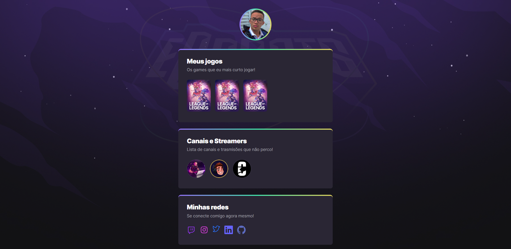

<p align="center">
    
</p>

---

Projeto construído do evento Next Level Week da Rocketseat.

-[🖥 Clique aqui para acessar](https://edusantos20.github.io/NLW_Esports/)

## ▶️ NLW eSports

- [Live Abertura](https://app.rocketseat.com.br/event/nlw-09/explorer/abertura)
- [Live Dia 01](https://app.rocketseat.com.br/event/nlw-09/explorer/aula-1)
- [Live Dia 02](https://app.rocketseat.com.br/event/nlw-09/explorer/aula-2)
- [Live Dia 03](https://app.rocketseat.com.br/event/nlw-09/explorer/aula-3)
- [Live Dia 04](https://app.rocketseat.com.br/event/nlw-09/explorer/aula-4)
- [Live Dia 05](https://app.rocketseat.com.br/event/nlw-09/explorer/aula-5)

## 💻 Tecnologias

- HTML
- CSS
- Git e Github

## 💬 Assuntos abordados

- HTML

  - Estruturação da página
  - Semântica
  - Acessibilidade

- CSS
  - Posicionamentos
  - Pseudo-elementos
  - Pseudo-classes
  - Animações

## 🎨 Variáveis de Animação CSS

```/**Animation**/
header div {
animation: fromTop 0.7s 0.2s backwards;
}
main section {
animation: fromBottom 0.7s backwards;
}

main section:nth-child(1) {
animation-delay: 0;
}

main section:nth-child(2) {
animation-delay: 0.4s;
}
main section:nth-child(3) {
animation-delay: 0.8s;
}

@keyframes fromTop {
from {
opacity: 0;
transform: translateY(-30px);
}

to {
opacity: 1;
transform: translateY(0);
}
}
@keyframes fromBottom {
from {
opacity: 0;
transform: translateX(-30px);
}

to {
opacity: 1;
transform: translateX(0);
}
}
```
